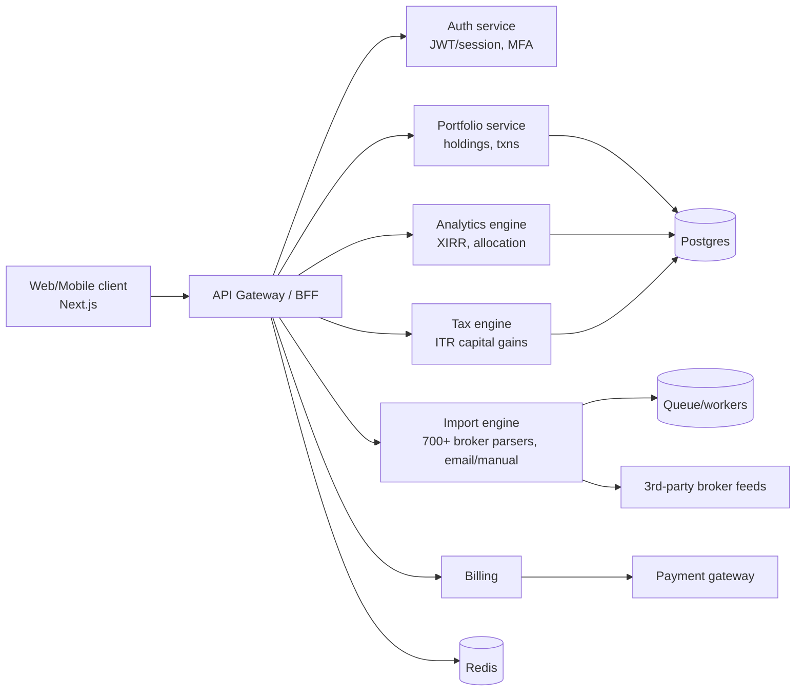

# Web-App Cloning Initiative — Blueprint Report
### Target: MProfit / "End Profit" (investment portfolio product) · 2026-08-24

> Prepared for the cloning-initiative team. Covers: the approach, what we found on the
> target, the system design to rebuild it, and a concrete effort/token/cost estimate with
> a build-or-not recommendation. Evidence is tagged **[observed]** (captured in a real
> browser/network session) or **[inferred]** (reasoned).

---

## 1. Executive summary
- We built **Blueprint** — a *plan-first* cloning agent (a skill + `/blueprint` command)
  that crawls a live product, **captures its real network APIs**, and produces this
  report + a runnable clone. It runs natively in Claude Code / Cursor / OpenCode. No Docker.
- **Key finding:** MProfit's public site is a **Gatsby static site with no runtime backend**.
  The real product (portfolios, imports, tax reports) is a **separate authenticated app**
  whose API we could **not** capture without login. So any "backend clone" from a public
  crawl is fabricated, not real. **[observed]**
- **Verdict against the 1-week kill-switch:** a **marketing + dashboard shell** is doable in
  a week; a **functional** End Profit clone is **not** (~4–8 weeks) — the 700+ broker import
  parsers and the ITR tax engine dominate and are not extractable by crawling.
- **The single highest-value next step:** an **authorized login capture** — it converts the
  entire backend from *inferred guess* to *observed contract*.

## 2. Approach (how Blueprint works)
```
/blueprint <url>
  → PHASE 1  crawl every screen (Playwright) · CAPTURE real network APIs ·
             analyze → PLAN.md (features, API surface, data model, system design,
             design/aesthetics plan, coverage, security, estimate)
  → GATE     stop, show plan, wait for go-ahead (all / frontend-only / authorized)
  → PHASE 2  build scoped clone: frontend + typed API client + schema +
             runnable mock backend + design system + regenerated SVG assets
```
Reuses existing skills: **Playwright MCP** (capture), **impeccable** (design system),
**seo-image-gen / nano-banana** (logo/SVG generation).

## 3. What we found on MProfit (observed)
- **Stack:** Gatsby SSG + React; content baked into `/page-data/*.json` (index = 42 KB).
  Analytics: Google GTM/GA4, Microsoft Clarity, DoubleClick. Marketing content via Sanity CDN.
- **No first-party runtime API** on the public site. `api.mprofit.in` root unreachable from browser.
- **14 public screens** captured (home, features, pricing, buy, import, login, sign-up, …).
- **0 product screens** captured — the app is behind login (email-first auth flow observed).
- **Coverage without login: ~15–20%** (the marketing shell, not the product).
- ⚠️ The team's "public pricing-calculator API" was **not** reproduced on the public site —
  it is behind auth or on the app subdomain, and must be re-captured logged in.

## 4. System design — to *rebuild* End Profit (target architecture)

**Recommended stack:** Next.js (FE) · Node/NestJS or FastAPI (services) · Postgres (Prisma)
· Redis (cache) · a queue (BullMQ/SQS) for import workers · JWT/session auth · Vercel/AWS.
**Scale/user prediction (assumed SME/HNI base):** ~10k–100k users, read-heavy (dashboards),
bursty writes on import; scales via stateless services + Postgres indexing/read-replicas +
cached analytics + async import workers. Critical paths: import→ledger, capital-gains compute.

## 5. Build estimation (headline)
| Layer | Complexity | Time (realistic) | Notes |
|---|---|---|---|
| Marketing site clone | S | 2–3 days | Gatsby SSG, static |
| Product frontend | L | 1–2 weeks | many stateful screens |
| Backend API + services | XL | 3–5 weeks | import engine + tax engine dominate |
| Auth + billing + compliance | L | 1 week | financial-grade, DPDP/SEBI |
| Design system + assets | M | 3–5 days | via impeccable + image-gen |

**AI models needed (per job):**
- **Opus** — architecture, backend/codegen, tricky logic (highest quality, highest cost).
- **Sonnet** — bulk frontend components, routine API routes (fast, cheaper).
- **Haiku** — mechanical passes (renames, boilerplate, doc extraction).
- **Image model** (Gemini/nano-banana) — logos, icons, illustrations → SVG.

**Token & $ estimate (agent-generated scaffolding, order-of-magnitude):**
- FE + API client + schema + mock backend + design pass: ~15–40M tokens across stages
  → **~$300–$1,200** in model cost (mixed Opus/Sonnet), depending on iteration.
- The real **broker parsers + tax engine are NOT cheaply agent-generatable** — budget
  real engineering weeks there, not tokens. Full functional build lands in the team's
  **$5k–$10k+** meeting range once engineering time is costed.
- **Infra run-cost** at predicted scale: ~$200–$800/month (DB + cache + workers + hosting).

## 6. Recommendation
1. **Do an authorized login capture first** (biggest lever — real API contract).
2. Scope the **1-week trial** to: authorized capture → real API map → FE shell + mock
   backend → this report refreshed with observed data. That fits a week.
3. A **functional** clone does **not** fit a week → per the kill-switch, drop to 1 person
   and pivot to the standalone GrabOn cloning agent (which Blueprint already is).
4. Treat the broker-parser/tax-engine as bespoke engineering, not cloning.

## 7. The tooling (what we shipped)
- **`/blueprint <url>`** command + **`blueprint`** skill — installed in Claude Code, Cursor,
  OpenCode. Plan-first, gated, honest (observed vs inferred).
- **One-command install:** `npx blueprint-skills install` (publishes to npm).
- Optional **CAO pipeline** (Docker) for running stages in parallel / at scale — the
  "agentize + offer as a service" path.

---
*Generated by the Blueprint initiative. Reliability note: all backend/API claims here are
inferred from a public crawl and become observed only after an authorized login capture.*
